# 🖥️ SafeVault UI

SafeVault UI is a Vue.js single-page web application that allows users to interact with the SafeVault API for banking operations.

It provides a clean user experience for:

- Account and balance viewing
- Airtime purchases
- Internal account transfers
- Viewing transaction history
- Managing personal profile details

This documentation focuses on **how to run** the UI and a **user experience walkthrough** (with screenshot placeholders you will populate).

---

## 🚀 Tech Stack

- **Framework:** Vue.js (Composition API)
- **Styling:** Tailwind CSS
- **API Integration:** Axios HTTP client
- **Authentication:** Simple Bearer token-style stub (temporary, users are seeded by the backend initializer)

---

## ▶️ Setup & Run

Prerequisites:

- Node.js 18+
- npm or yarn installed

Install dependencies:

`npm install`

Run the UI locally:

`npm run serve`

The app will be available at:

http://localhost:5173/

> The UI requires the SafeVault API running.  
> See backend documentation: `../SafeVaultApi/README.md`

---

## 🔑 Test Login Details

There is **no registration process** in this release.  
Test users are created automatically by the backend initializer.

Use the following credentials to log in:

| Email               | Password | Description          |
|---------------------|----------|----------------------|
| test@safesystems.dev | Pass@123 | Primary demo user    |
| user@safevault.io    | Pass@123 | Secondary demo user  |

Each seeded user has:

- One or more bank accounts
- Starting balances
- Sample transactions, so the UI features can be demonstrated immediately

---

## 🧭 User Experience Walkthrough

> Replace each screenshot path with real UI screenshots captured from your running application.

---

### 1️⃣ Login Page

- User authenticates to access the banking dashboard
- Validation messaging for incorrect login attempts

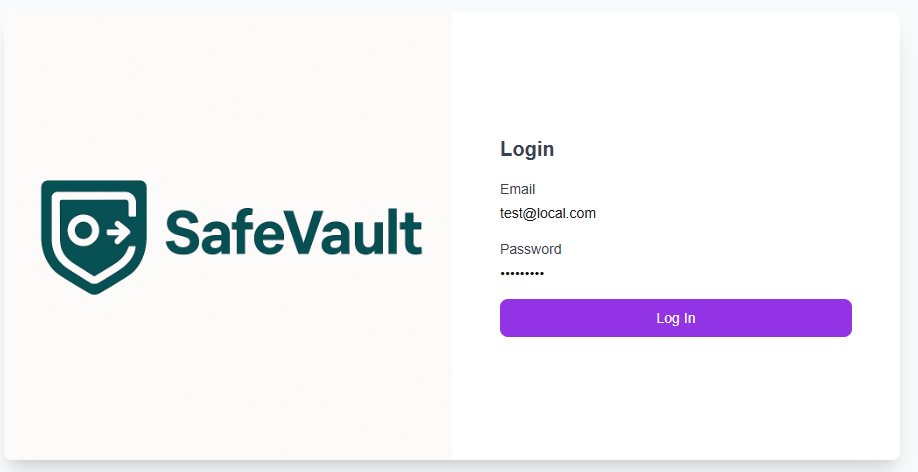

---

### 2️⃣ Dashboard / Landing Page

Displays:

- User greeting
- Account summary cards
- Quick navigation actions

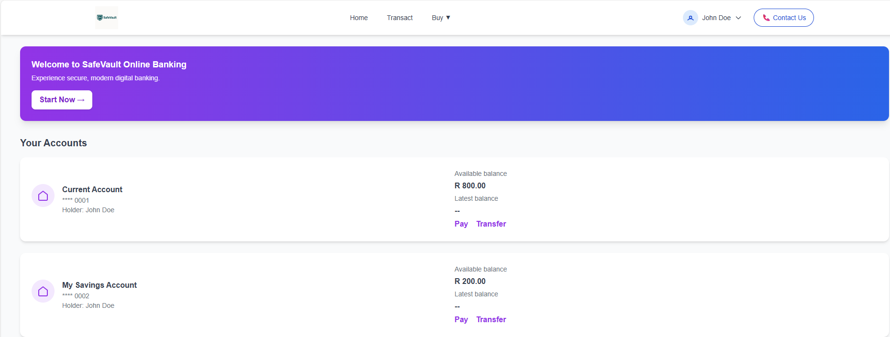

---

### 3️⃣ View Transactions

- Lists all transactions for selected account
- Sorted by most recent
- Shows basic transaction details

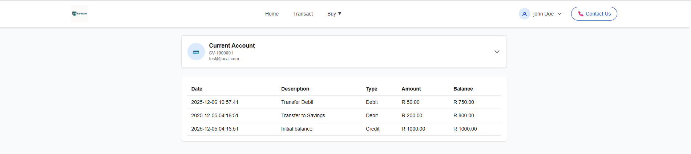

---

### 4️⃣ Internal Account Transfer

- Move funds between user-owned accounts
- Form validation for amounts and balances

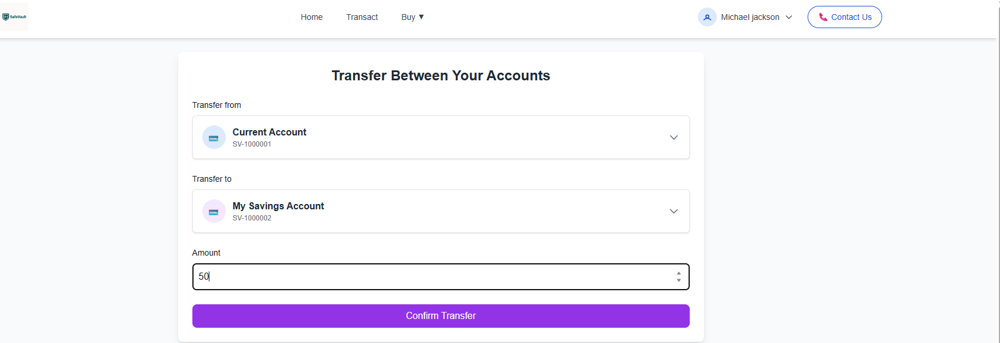

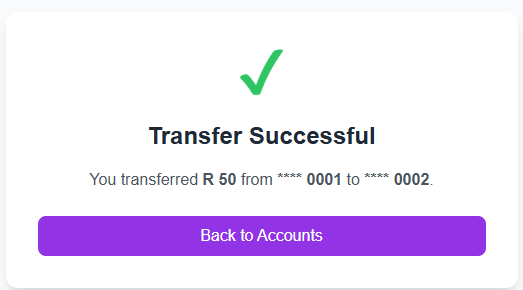

---

### 5️⃣ Airtime Purchase

- Select a funding account
- Choose a network provider (mock)
- Enter an amount and confirm

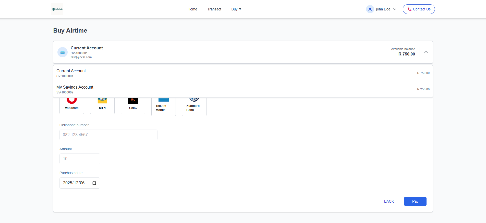  
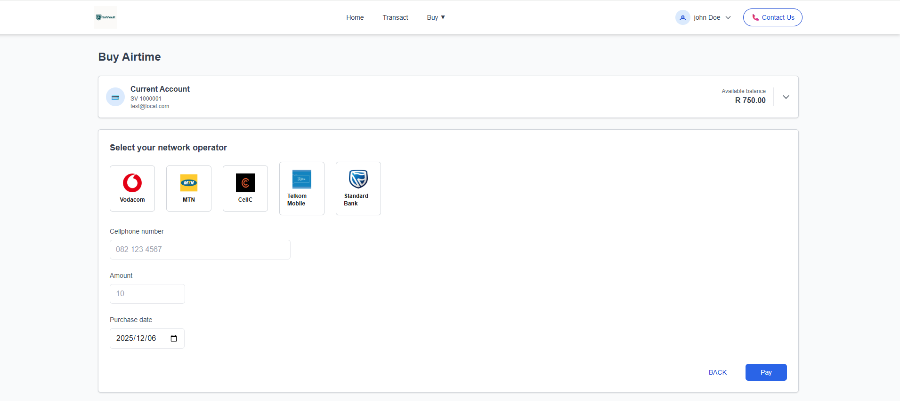  
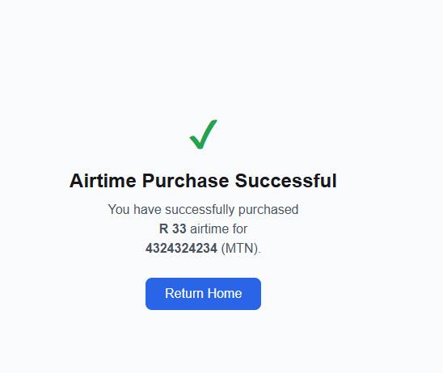

---

### 6️⃣ Profile Management

- View and update user details (name, email, phone)
- Edit mode confirmation

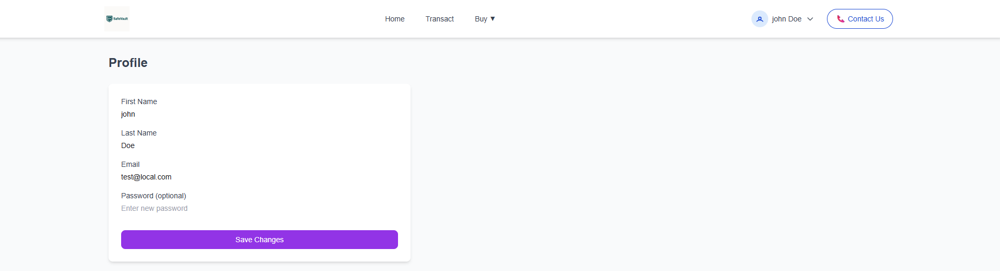  

---

### 7️⃣ Payment (external account)

Each account card includes:

- **Send Money** (renamed from Pay) → external payment flow *(to document separately)*

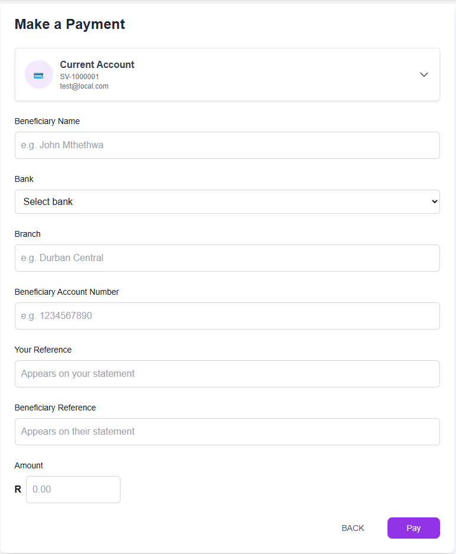  
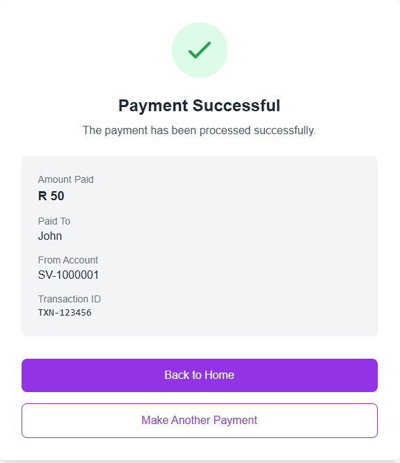

---

## 📌 Backend Dependency

SafeVault UI depends on the SafeVault API:

`../SafeVaultApi/README.md`

---

## 📝 Assessment Requirement Coverage

| Requirement                       | Status     |
|-----------------------------------|------------|
| Login and authentication          | ✔️ Complete |
| View balances and account info    | ✔️ Complete |
| Transaction history               | ✔️ Complete |
| Internal transfers                | ✔️ Complete |
| Airtime purchases                 | ✔️ Complete |
| Profile management                | ✔️ Complete |
| External payments                 | 🚧 Planned  |

Screenshots in this document will serve as delivery proof.

---

End of UI Documentation
